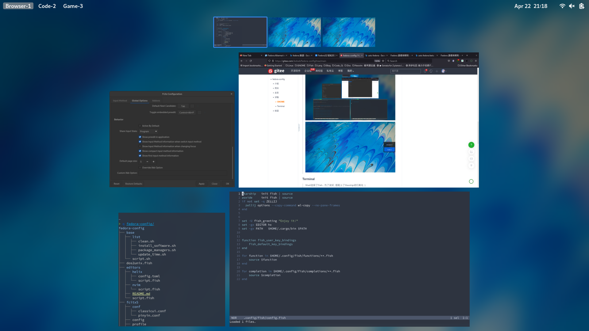
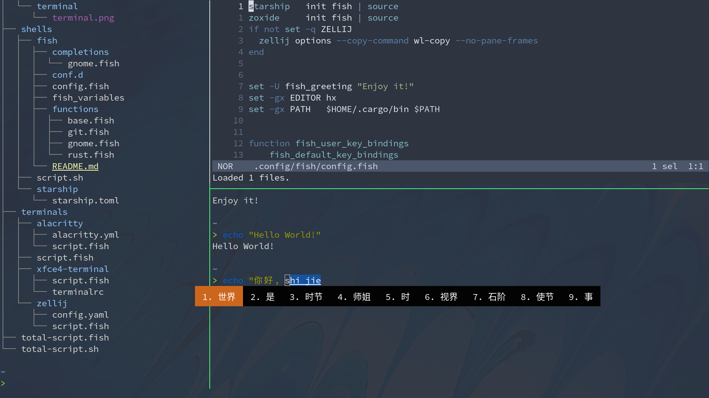

# fedora-config

## 介绍
我的 `Fedora-Linux` 配置 && 一些帮助脚本  
当你安装好一个崭新的Fedora系统后， 只需在终端执行如下命令  
即可享受一个配置/美化完毕， 开箱即用的桌面环境  

**注意:**  
**Fedora的版本为: 36**

## 用法

```bash
git clone https://gitee.com/jedsek/fedora-config
sh fedora-config/total-script.sh
```

## 总览

|Item|Name|
|:---|:---|
|DE|GNOME 42|
|Shell|Fish|
|Terminal|Alacritty & Zellij|
|Editor|Helix|
|Input Method|Fcitx5|


## 详情
### GNOME
> 基于GNOME进行了美化  
> 详情请点击传送门: [To GNOME](gnome/)  
  
  

### Terminal/Shell 
> Shell选择了Fish, 搭配上了Starship  
> 终端与复用器, 分别选择了 Alacritty 与 Zellij  
> 关于具体配置, 请点击传送门: [To Shell](shells/) && [To Terminal](terminals/)  


### Editor
> Helix-Editor 万岁!
> 当然, 也搭配有其他选项, 不过不推荐


## 结语
该项目力求跟上时代, 永不过时  
因此若发现存在过时的配置(或Bug)，请及时联系我， 谢谢  
最后， 祝你玩得开心 :D  
Enjoy it ! !