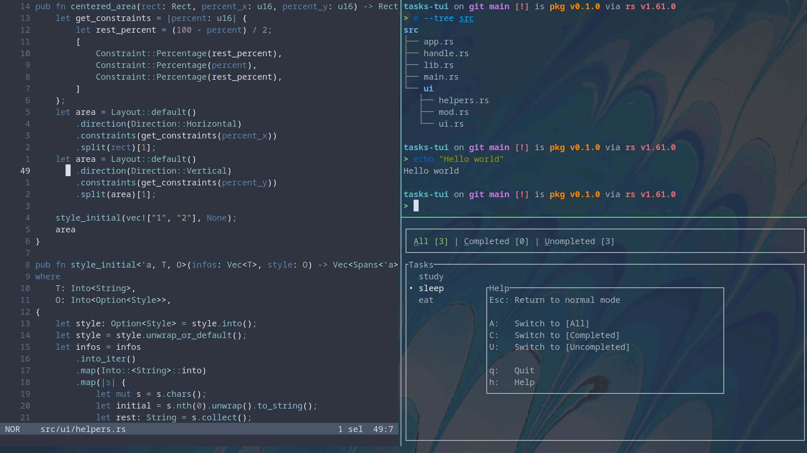

# fedora-config
我的 `Fedora-Linux` 配置 && 一些帮助脚本  
当你安装好一个崭新的Fedora系统后， 只需在终端执行如下命令  
即可享受一个配置/美化完毕， 开箱即用的桌面环境  

**注意:**  
**Fedora的版本为: 36**

## 使用

```bash
git clone https://gitee.com/jedsek/fedora-config
sh fedora-config/total-setup.sh
```

## 总览

|Item|Name|
|:---|:---|
|DE|GNOME 42|
|Shell|Fish + Starship|
|Terminal|Alacritty + Zellij|
|Editor|Helix|
|Input Method|Fcitx5|

## GNOME
> 基于GNOME进行了美化  
> [To GNOME](gnome/)  

  
  

## Terminal/Shell 
> Shell: Fish + Starship  
> Terminal: Alacritty + Zellij  
> [To Shell](shells/) && [To Terminal](terminals/)  




## Editor
> Helix-Editor 万岁!  
> 当然, 也有其他的可供选择, 不过并不推荐  
> [To Editor](editors/)


## Fcitx5
> Fcitx5已经蛮香的了, 主题配置也很简单  
> 我修改了下其快捷键, 词典, 历史记录等  
>[To Fcitx5](fcitx5/)  

## 结语
该项目力求跟上时代, 永不过时  
因此若发现存在过时的配置(或Bug)，请及时联系我， 谢谢  
 
最后， 祝你玩得开心 :D  
Enjoy it ! !